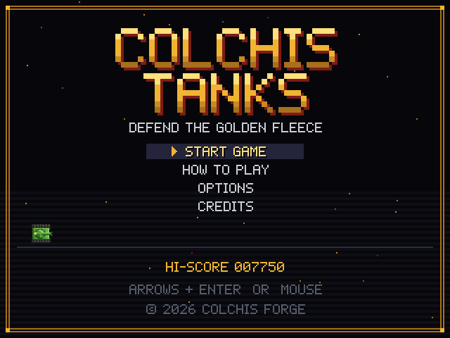
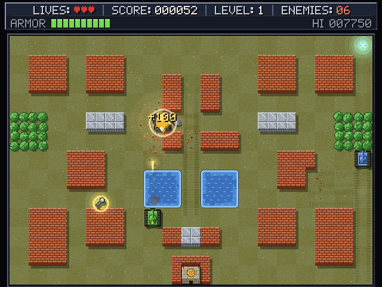
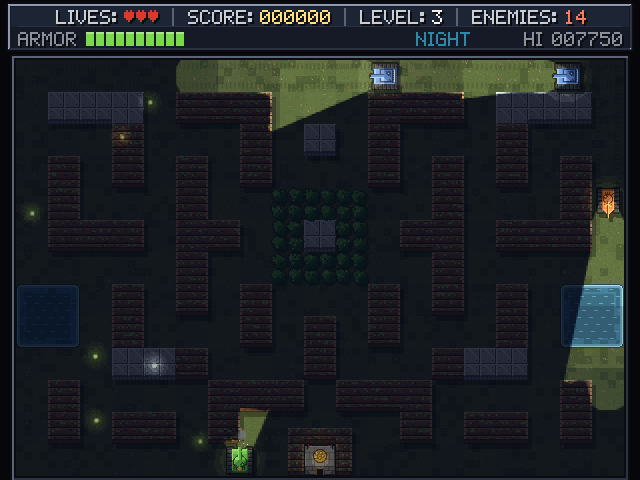

# 🪖 Colchis Tanks

A retro-inspired top-down tank battle game built with TypeScript and HTML5 Canvas.

<h2 align="center"><a href="https://colchisforge.github.io/colchis-tanks/">🎮 PLAY COLCHIS TANKS</a></h2>

<p align="center">
  <strong><a href="https://colchisforge.github.io/colchis-tanks/">PLAY ONLINE</a></strong>
  · runs in your browser · nothing to install, no account, no download
</p>

<p align="center">
  
  
  
</p>

Defend the Golden Fleece. Enemy tanks pour in from the top of the map; knock out every one of them, and
their crews, before they break through the walls and destroy your base.

## Features

- **Retro tank combat** with responsive four-way controls and grid-assisted cornering
- **Two guns per tank**: the cannon for armour and walls, a coaxial machine gun for crews on foot
- **Tank crews**: shells disable a tank instead of blowing it up; the crew bails out and fights on
- **Field repairs**: a wrench drops somewhere on the map; grab it, get back to your wreck and fix it
- **Stealth on foot**: enemies cannot see a crew hiding in a bush or behind a wall
- **Destructible environments**: brick walls crack, then crumble, and the holes stay open
- **Clever enemies** with line of sight, route planning to firing lanes, machine-gun bursts at exposed
  crews, deliberate sieges of your base, and crews of their own who race you for wrenches or retreat
- **Three enemy types**: basic, fast and heavy, each with its own look, speed and armour
- **Five handcrafted levels across five lands**: grassland, a sandy coast with surf, a mossy forest of log
  walls, a snowy mountain pass that keeps every track, and the gilded stone of the Colchis fortress.
  Walls, water and bushes restyle for each land
- **Night missions**: the field goes dark and only light shows what is there. Headlights, burning wrecks,
  muzzle flashes and explosions light it up, and every enemy searchlight beam is exactly what its crew can
  see, so a crew on foot can sneak around the beams
- **Power-ups**: Rapid Fire, Shield and Extra Life, dropped by flashing enemy tanks
- **Health-based damage**, lives, scoring, end-of-level bonuses and a saved high score
- **16-bit look with real depth**: raised walls with drop shadows, shadows under every tank and crate,
  tread tracks, tracer rounds, explosions that light the ground, shockwaves, bouncing debris that settles
  into rubble, spent casings, wind-blown smoke, burning wrecks, and sea spray, fireflies, snowfall or
  drifting motes depending on the land. Optional screen shake and flashes
- **An enemy HQ to storm**: every level has a fortified enemy headquarters at the top of the map. Blow
  it up to win outright, if you can: it has its own guns covering its front, guard tanks posted around
  it, and when you get close an alarm sends the nearest tanks after you and rushes in reinforcements
- **Anti-tank rockets and mines**: a crew bailing out takes its rocket launcher, and one hit destroys any
  tank outright. Every rocket fired calls in a fresh crate somewhere on the map. Mine crates turn up too;
  plant them on the roads and let the enemy roll over them. Enemy crews lay mines too, on the approaches
  to their HQ, and their own tanks know where they are
- **Machine-gun tracers**: every third round glows green along its whole flight, behind a yellow muzzle
  flash, the rest are a faint flicker; at night the tracers light the ground they cross
- **Vehicle physics**: tanks accelerate, brake and carry momentum according to their weight and engine,
  and every force goes through the tracks, so the ground's grip limits it. On snow they spin their tracks,
  slide long distances before stopping and drift through turns; dirt roads grip but slow them down
- **Ground that matters**: each land has its own surface (grass, sand, moss, snow, paving). The mountain pass
  is 60% snow and 40% dirt road, and enemy drivers keep to the roads
- **Realistic synthesised sound**: cannon blasts, machine guns, ricochets, brick and steel impacts, rockets,
  mines and explosions are built from layered noise, saturated booms, metal resonances and falling debris,
  placed in stereo, muffled with distance and given an outdoor echo. The diesel engine revs with the
  throttle, the tracks clatter faster with speed and crunch when they slip on snow, and you can hear
  enemy tanks approaching
- **Original chiptune music**, played live by a step sequencer
- **Browser-based gameplay** with crisp pixel scaling and settings saved on your device

## Controls

```text
WASD / Arrow Keys    Move
Space                Cannon (hold for auto-fire)
F                    Machine gun
E                    Get out of the tank / climb back in
On foot: Space       Fire the anti-tank rocket
On foot: F           Plant a mine
P                    Pause
R                    Restart (hold during play, tap when paused)
Escape               Pause / back / menu
```

Menus work with the arrow keys and Enter, or with the mouse.

## Crews and repairs

- A tank whose hull health runs out is **disabled**: it becomes a smoking wreck and its crew bails out.
  Keep shooting a wreck and it explodes for good.
- Losing a tank does not cost a life; **losing the crew does**. On foot you are small and quick and can
  slip through one-tile gaps, but machine guns and tank tracks are deadly and water stops you.
- When a tank is knocked out, a **wrench** appears somewhere a soldier can reach. Pick it up, stand next to
  your wreck and the crew repairs it (back to 60%) and climbs in. If your wreck is destroyed, a new tank
  waits at your spawn point.
- **Bushes and walls hide you.** Enemies only open fire on crews they can see.
- A crew that bails out takes **one anti-tank rocket**. It destroys any tank in a single hit, crew and all
  (a shield stops it). Fire it and a fresh rocket crate is dropped somewhere on the map; a crew carries
  one rocket at a time.
- **Mine crates** turn up every so often. Carry up to two, press F to plant one on the tile you stand on,
  and after a short arming delay the next tank to roll over it is knocked out. Mines do not care whose
  tank it is, and crews on foot are too light to set them off.
- Enemy crews may carry rockets too. One that lines up on your tank raises its launcher (you will hear
  it, and see a red warning) before it fires; kill it, or get out of line.
- Enemy crews play by the same rules: finish them with the machine gun before they repair their tank,
  or destroy the wreck so there is nothing to repair.
- The base takes three hits and raises the alarm on the first one.

## The enemy HQ

- Destroying the enemy headquarters wins the level on the spot, with a 2000 point bonus. Clearing
  every enemy still works too.
- It is dug in behind a brick ring with steel corner posts and a second wall in front, and takes twelve
  hits. Only your fire hurts it; a rocket counts as three hits.
- Its garrison works an anti-tank gun and a machine gun out of two ports facing the field, so a frontal
  assault walks into their fire. The flanks are open, and on some maps steel already guards the front.
- One or two **guard** tanks hold posts around it. Come within about seven tiles, or hit it, and the
  **alarm** sounds: the three nearest tanks drop whatever they were doing to hunt you down, and
  reinforcements arrive twice as fast, two more at a time. The HUD shows the HQ's strength and flashes
  red while the alarm is up.
- **Enemy mines** are buried on the approaches, by preference on the roads. All you see is a patch of
  disturbed earth (nothing at all at night) until your tank or crew is right next to one.

## Play Online

Open **[the game](https://colchisforge.github.io/colchis-tanks/)** in any modern desktop browser. No installation is
required. The game is a static page served by GitHub Pages and runs entirely on your machine; there is no
server, database or login. Settings and the high score are kept in your browser's local storage.

## Run Locally

Requires Node.js 20.19 or newer.

```bash
npm install
npm run dev
```

Then open the URL Vite prints (usually http://localhost:5173).

## Production Build

```bash
npm run build
```

The static site is written to `dist/`. Preview it with `npm run preview`. Assets are referenced with
relative paths, so the build works at a sub-path such as `/colchis-tanks/` as well as at a domain root.

Other scripts:

```bash
npm run lint      # ESLint
npm run test      # Vitest
npm run typecheck # TypeScript, no emit
```

## Architecture

The simulation knows nothing about the screen, the keyboard or the speakers, so it can be tested headless and
presented however the front end likes.

```text
src/
├── core/        geometry, seeded RNG, small helpers
├── game/        Game state machine, Battle (one level in progress), loop, config, session, settings
├── entities/    Tank (+ PlayerTank, EnemyTank), Soldier, Crew, Bullet, Wrench, PowerUp, AI brains, components
├── world/       Tile definitions, the mutable TileMap, level format, level data and LevelManager
├── systems/     Collision, Movement (vehicle physics), Combat, Crew, Repair, Supply, Mine, Garrison,
│                Perception, Pathfinder, tank and infantry AI, Spawn, PowerUp and Score systems
├── rendering/   Renderer, map/tank/shell/effects/lighting/ambient renderers, procedural pixel art,
│                per-land styles, bitmap font, palette
├── effects/     Particles, explosions and floating text (visual only)
├── audio/       Web Audio synth and mixer, sound designs, diesel engine model, music sequencer
├── input/       Keyboard and mouse handling
└── ui/          Menus, HUD, pause, level-complete, game-over and victory screens
```

- **Game loop**: `requestAnimationFrame` drives a fixed 1/120 s simulation step with an accumulator, then
  renders once per frame, so gameplay is identical at 60 Hz, 144 Hz or anything else.
- **State machine**: each `GameState` (`MENU`, `HOW_TO_PLAY`, `OPTIONS`, `CREDITS`, `PLAYING`, `PAUSED`,
  `LEVEL_COMPLETE`, `GAME_OVER`, `VICTORY`) is its own screen. Menu code never touches gameplay code.
- **Battle and systems**: `Battle` owns the live map and entities for one level and runs the systems in a fixed
  order each tick. Collision queries live in one `CollisionSystem` shared by tanks and shells.
- **Events**: the simulation reports facts (`shot`, `shellImpact`, `tankDestroyed`, …). `BattleFeedback` turns
  them into particles, screen shake and sound, keeping presentation out of the game rules.
- **Data-driven content**: levels are text layouts plus an enemy roster string, tiles are a property table,
  power-ups and status effects are registries, and every tuning number lives in `GameConfig.ts`.
- **Art and sound** are code: every sprite and tile is painted pixel by pixel at twice the game resolution
  (`rendering/art/`) and cached; terrain is kept in layers so a hit wall only repaints the tiles around
  it. The font is a hand-drawn 5×7 bitmap font, and all audio is synthesised at run time.
- **Lighting**: night darkness lives in its own game-resolution layer. Lights cut holes into it with banded,
  hard-edged falloff, and searchlight beams are ray-cast against the walls with the same sight rules the
  enemy AI uses (`Perception`).
- **Physics**: `MovementSystem` integrates each tank's velocity at the fixed 120 Hz step. Engine pull
  (fading near top speed), braking and sideways friction are all capped by the grip of the surface under
  the hull (`world/Surface.ts`, tuned in `PHYSICS_CONFIG`); collisions are inelastic and report their
  impact speed. AI drivers plan routes by ground cost, brake to make their turns, slow down before
  swinging onto the other axis and roll up to obstacles at a crawl.
- **Audio**: every effect is a `SoundDesign` played into its own `Voice` (gain, distance low-pass,
  stereo position, reverb send), built from noise in three colours, saturated oscillators, inharmonic
  metal modes and scattered debris grains. A compressor glues the mix, a voice cap keeps bursts clean,
  and `EngineSound` models the diesel and running gear continuously for your tank and the loudest enemy.

### Crews, soldiers and the AI

- **Units and intents**: tanks and soldiers both implement `Mobile` and act only through a `UnitIntent`
  (move, fire, machine gun, get in/out). Player input and AI produce intents; the movement and combat
  systems carry them out with the same rules for everyone.
- **A tank is components**: hull `Health`, wreck `integrity`, a cannon and a machine gun (`Weapon`),
  `StatusEffects` and a `Crew`. A tank only drives and shoots while it is operational *and* manned. The crew
  has stations (driver, gunner, machine gunner); with one member aboard that member works all of them, and a
  second member will take the machine gun in two-player co-op.
- **Soldiers** are a separate entity with `foot` mobility: every tile declares which mobility classes it
  blocks, how it affects shells and sight, and whether it gives `concealment` (bushes do).
- **Perception** answers "can this tank see that soldier?" (walls block sight, bushes and bail-out smoke
  hide, very close is always seen). **Pathfinder** plans routes on the tile grid with a cost for blasting
  through brick, routing around wrecks.
- **EnemyAISystem** (tanks): patrol, hunt along planned routes to the nearest firing lane, machine-gun
  visible crews, shell your empty or wrecked tank, and besiege the base only by deliberate choice. Roles
  come first: guards hold posts around the HQ, and while the alarm is up the nearest tanks defend it,
  hunting the intruder down. Drivers never fire into their own HQ's walls and steer around their own mines.
  **InfantryAISystem** (enemy crews): fetch a wrench, repair, re-board, fire a rocket when your tank lines
  up, collect mine crates and lay them on the HQ's approaches, hide while waiting, or retreat.
- **GarrisonSystem**: the HQ's own anti-tank gun and machine gun, covering the ground in front of it.

## Testing

Vitest covers the rules that matter: tank, soldier, wall, water and boundary collision, shell and
machine-gun impacts, disabling versus destroying tanks, crews bailing out, getting in and out, wrenches and
repairs, replacement tanks, line of sight and bush concealment, being run over, scoring, destructible
bricks, base destruction leading to game over, level completion and victory, lives and respawning, pausing,
power-ups, the tank and crew AI (including an end-to-end enemy repair), route planning, level validity and
settings persistence, vehicle physics on every surface, rockets and mines for both sides, and the enemy
HQ: its fortification, damage rules, garrison, guards, alarm and reinforcements.

```bash
npm run test
```

## Deployment

Two GitHub Actions workflows live in `.github/workflows/`:

- **`ci.yml`** runs `npm ci`, lint, tests and a production build on every push and pull request.
- **`deploy.yml`** runs the same checks on pushes to `main` and, only if they all pass, publishes `dist/` to
  GitHub Pages with the official `actions/upload-pages-artifact` and `actions/deploy-pages` actions.

To enable it in a fresh repository named `colchis-tanks`:

1. Push the code to the `main` branch.
2. In **Settings → Pages**, set **Source** to **GitHub Actions**.
3. The next push to `main` (or a manual run of *Deploy to GitHub Pages*) publishes the game at
   `https://colchisforge.github.io/colchis-tanks/`.

## Roadmap

```text
[x] Player tank
[x] Enemy tanks
[x] Shooting
[x] Destructible environment
[x] Enemy AI
[x] Multiple levels
[x] Power-ups
[x] GitHub Pages deployment

Stage 1 — crews (done)
[x] Tank crew
[x] Soldier exit/enter
[x] Machine guns
[x] Disabled tanks and wrecks
[x] Bush concealment and line of sight
[x] Tank repair (wrench)
[x] Enemy crews that bail out, repair or retreat
[x] Smarter enemy tanks (route planning, firing lanes, sieges)

Stage 2 — infantry combat
[ ] Rifle
[ ] Grenades
[ ] Armour-piercing rockets that destroy tanks outright
[ ] Enemy crews that fight back on foot

Stage 3 — even smarter enemies
[ ] Dodging incoming shells, flanking, coordinated attacks, retreating when damaged

Stage 4 — local multiplayer
[ ] Two players sharing one tank: one on the cannon, one on the machine gun
```

The crew system is being built in stages so each one is playable on its own. The code already has the
hooks for the later stages: crew stations for a second player, and soldiers ready to carry weapons.

## License

[MIT](LICENSE) © 2026 Colchis Forge.

Every asset in the game — pixel art, font, maps, sound effects and music — is original and generated from the
source code in this repository. Colchis Tanks is inspired by classic 8-bit tank games but contains no graphics,
sounds, maps or code from them.
